

  

   

  
  
  
  

 

## 01 // Contribution Matrix

  <a href="https://github.com/Haruto69">
    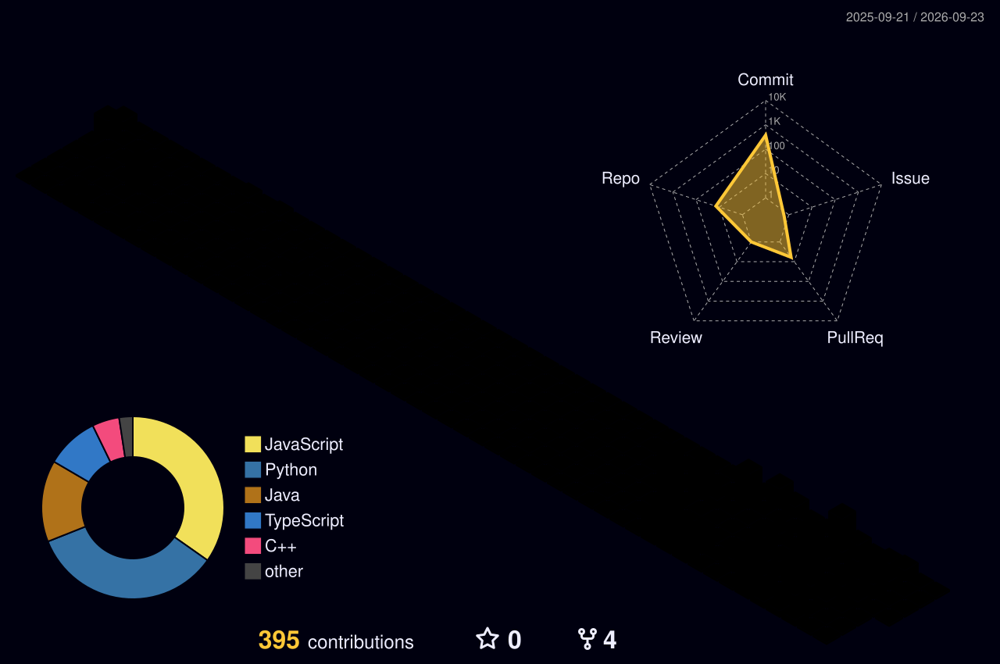
  </a>
  Generated daily from real GitHub contribution data by GitHub Actions.

## 02 // Developer Telemetry

  
  

  <samp>DATA SOURCE // SELF-HOSTED GITHUB TELEMETRY · SIGNAL // LIVE</samp>
   
  Language distribution describes repository composition, not proficiency.

## 03 // Activity Signal

  

## 04 // About

I'm **Mukund V**, a Computer Science and Engineering undergraduate specializing in **Cyber Security** at **RNS Institute of Technology, Bengaluru**. I build full-stack and backend systems across Spring Boot, React, and Node.js, with an emphasis on secure engineering, DevSecOps automation, generative AI and RAG integrations, cloud/container tooling, and IoT systems.

I like software that does one thing reliably: clear architecture, sensible defaults, and security built into the development loop.

  

## 05 // Technology Arsenal

  <samp>SYSTEM CAPABILITY MATRIX // VERIFIED TOOLCHAINS</samp>

 

  
  
   
  
  
   
  
  

## 06 // Featured Systems

  
  

 

  <samp>ACTIVE PROJECT NODES // REPOSITORY UPLINKS</samp>

 

  <a href="https://github.com/Haruto69/arclume"></a>
  <a href="https://github.com/Haruto69/reposcope"></a>
   
  <a href="https://github.com/Haruto69/Self-care"></a>
  <a href="https://github.com/Haruto69/velora-music"></a>
   
  <a href="https://github.com/Haruto69/Smart-attendance"></a>

 

  <samp>LIVE UPLINKS //</samp>
    
  
  

 

  

## 07 // Highlights

  

## 08 // Current Signal

  

## 09 // Open to Opportunities

Open to internships and early-career work across **backend/full-stack engineering**, **GenAI and LLM systems**, and **security-focused software or DevSecOps**.

  
  
  
  

 

  <samp>SYSTEM // STANDBY &nbsp;·&nbsp; BUILD // ITERATE &nbsp;·&nbsp; SIGNAL // OPEN</samp>
    
  <em>Build things that work. Then make them work well.</em>

